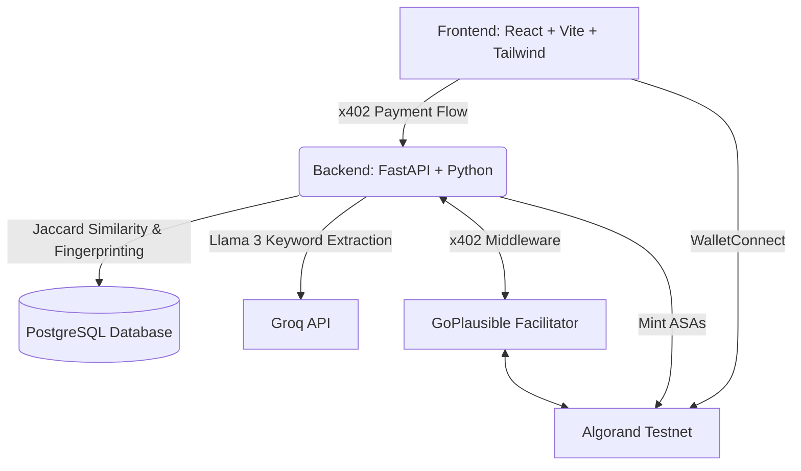

# 🛡️ LeakGuard Studio

**The Next-Generation Web3 Platform for Digital Artists to Protect, Sell, and Verify their Art using Algorand & x402.**

## 🎯 Problem and Solution

**The Problem:**
Digital artists face a massive problem with AI scraping, copyright infringement, and unauthorized reselling. Once an artwork is posted online, artists lose control over it. Furthermore, hiring talented creators usually involves high middleman fees on traditional platforms.

**The Solution:**
LeakGuard Studio is a decentralized platform that uses **Algorand ASAs (Algorand Standard Assets)** and **x402 Paywalls** to protect artists. 
When an artist uploads an artwork, we generate a unique cryptographic AI fingerprint and mint it as an ASA on the Algorand blockchain. This allows artists to explicitly prove ownership. We also offer x402-gated AI tools (like our AI Leak Detector and Portfolio Matcher) to help artists track their stolen work across the internet and connect with clients via microtransactions without any platform fees!

## 🚀 Unique Selling Proposition (USP)
Unlike traditional art platforms (like DeviantArt or ArtStation), LeakGuard Studio:
1. **Verifies Originality Instantly**: Prevents stolen art uploads by checking AI fingerprints against the blockchain.
2. **x402 AI Services**: We monetize heavy AI computation (like Reverse Image Searching and Semantic Creator Searching) using the HTTP 402 Payment Required protocol. Users pay fractions of a cent (e.g., $0.01 USDC) directly to the server via Algorand, bypassing subscription paywalls entirely!
3. **Decentralized Escrow**: Art licensing and freelance bounties are handled securely via Algorand Smart Contracts.

---

## 🏗️ Architecture Diagram



---

## 🔗 x402 Transaction Proof (Algorand Testnet)

Our AI endpoints (Leak Detection, Portfolio Matching, Search) are protected by x402. When a user runs an AI scan, a microtransaction is executed.

* **Replace this text with a link to your x402 transaction on Lora Explorer!** 
* Example: `https://lora.algokit.io/testnet/transaction/YOUR_TX_ID_HERE`

---

## 💻 Running the Project Locally

### Prerequisites
- Python 3.10+
- Node.js v18+
- PostgreSQL
- An Algorand Testnet Wallet (e.g., Pera Wallet or Defly) with Testnet Algos & USDC.

### 1. Start the Backend (FastAPI)
```bash
cd aiml
python -m venv venv
source venv/bin/activate  # On Windows use `venv\Scripts\activate`
pip install -r requirements.txt

# Start the server on port 8000
uvicorn main:app --reload --port 8000
```

### 2. Start the Frontend (Vite/React)
```bash
cd frontend
npm install
npm run dev
```

### 3. Testing the x402 Flow
1. Open the frontend at `http://localhost:5173`.
2. Connect your Algorand Testnet wallet in the top right.
3. Click the `...` menu and select **AI Leak Detector** or **AI Portfolio Matcher**.
4. Click "Run Scan". Your wallet will prompt you to sign a microtransaction (e.g., 0.02 USDC) via the GoPlausible facilitator.
5. Once signed, the backend will verify the payment and return the AI results!

---

## 📦 Built With
* **Frontend**: React, Vite, TailwindCSS, `@txnlab/use-wallet-react`
* **Backend**: Python, FastAPI, `x402` SDK
* **Database**: PostgreSQL (`asyncpg`)
* **AI/ML**: Groq (Llama-3.1-8b-instant), Pillow (Image processing)
* **Blockchain**: Algorand Python SDK (`algosdk`), Algorand Standard Assets (ASAs)
